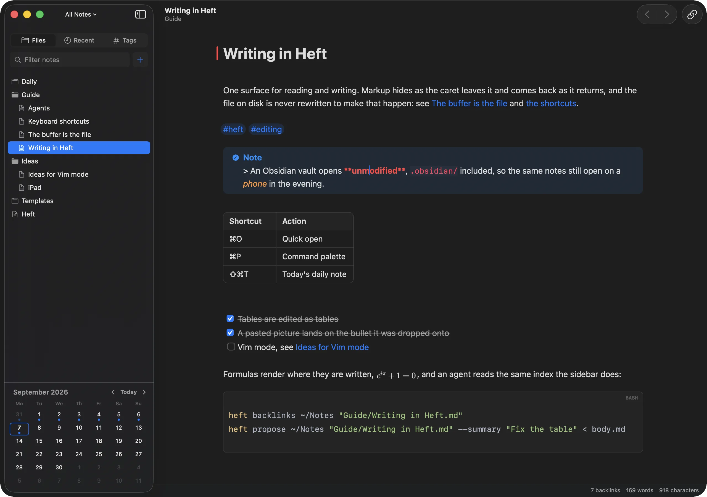
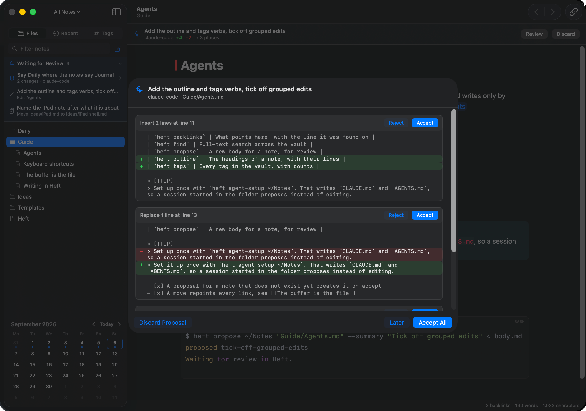

# Heft

**Somewhere you actually want to write.**

A Mac app for Markdown notes: nice to write in, your files stay yours, and a
command line built for the coding agent you already use. Native Swift, no
Electron, no lock-in.



Apple Notes and Bear feel right, but your notes live in a database nothing else
can open. Obsidian keeps them as plain files you own, but it is a web app in a
window: drag a note out into a terminal and nothing happens. Heft is the feel
of the first with the files of the second.

The same split shows up the moment you point an agent at your notes. Obsidian
gives it plain Markdown and nothing else, so it falls back to grep. The apps
that hold your data answer it by selling you an assistant of their own. Heft
does neither: the `heft` command hands an agent a resolved index of the vault
to read from, and lets it propose changes for you to review hunk by hunk.



Bring whichever agent you already use. Heft has none of its own to sell you.

Point it at any folder of Markdown files, or at an existing Obsidian vault,
which opens unmodified: no import, no database, nothing to migrate out of. It
stays a normal vault, so those same notes still open and edit in Obsidian on
your phone. Quick open (⌘O), a command palette (⌘P) and recents are where you
would expect them.

Oh, and it has daily notes, capture from Spotlight, and a Vim mode (yes,
really).

```bash
brew install --cask josteng/tap/heft
```

Requires macOS 26 on Apple Silicon. That installs `Heft.app` and a `heft`
command, signed and notarised, and `brew upgrade` follows new releases. To
build it yourself instead, with Xcode installed:

```bash
git clone https://github.com/josteng/Heft.git
cd Heft
Scripts/install.sh
```

**New here? [`Docs/GettingStarted.md`](Docs/GettingStarted.md)** covers opening
a vault, the five things worth trying first, daily notes and capture.

---

## Why you might want it

- **It is nice to write in.** One live surface, not source/split/preview.
  Markup hides and comes back as the caret moves through it, and the file on
  disk is never rewritten to make that happen. Tables are edited as tables.
  Pictures land on the bullet you paste them onto. `->` becomes an arrow as
  you type.
- **It behaves like a Mac program.** `heft .` opens a folder the way `code .`
  does. Spotlight files a line into today's note or your inbox without you
  leaving what you were doing. Dragging a note into Mail attaches the file
  itself, because the path resolves and keeps resolving.
- **Agents read a resolved index, and write only by asking.** A text search
  finds the words in a link; it does not know what the link points at.
  `heft links` and `heft backlinks` do, aliases and headings and all, and they
  say which links point at nothing. `heft config` reports your daily-note
  folder and filename format, so what an agent writes matches the rest of your
  vault. And when it wants to change something, `heft propose` puts that in a
  banner above the note, to accept or reject hunk by hunk.

Also in there: daily notes and a calendar, PDF export of the rendered note
rather than the source, and capture from Spotlight.

Built because Obsidian plus Claude Code is a genuinely good way to keep notes,
and Obsidian is the half I stopped enjoying: slow to start, and never quite a
Mac app.

*Heft* is German for a school exercise book, which I always preferred writing
in to a notepad. In English it means weight and substance. Both were the point.

---

> [!NOTE]
> Everything below is reference. It is long because the app has a lot of
> surface (and because I used AI to draft the rest of this README), and nobody
> needs to read it end to end: skim whatever looks interesting, or point your
> agent at this file when you want to know whether Heft does some particular
> thing. Once it is installed, `heft help` is faster than scrolling.
>
> And yes, this app is heavily vibe-coded. But it is what I write my own notes
> in every day, and I intend to keep fixing and improving it, with whatever I
> find or you report.

## Writing

There is one surface. Markup is hidden by collapsing it: the characters stay
in the buffer and keep their place in every offset, so the buffer always
equals the file byte for byte, and selecting across hidden markup copies real
source. Block markup (heading hashes, list and quote markers, fences) comes
back when the caret is anywhere on its line; inline spans (`**bold**`,
`$math$`, links) only when the caret is inside them. Emphasis styles from the
opening delimiter, so `**bold` is already bold while you are still typing it.

What renders in the editor: headings both ways (`# x` and an underlined
line), emphasis, `==highlights==`, code spans and syntax-highlighted fences,
block quotes, Obsidian callouts, task lists, nested bullets that change shape
by level, tables, images, LaTeX, note transclusion, footnotes, wikilinks with
aliases, headings and blocks, and YAML frontmatter as a properties card. What
is missing is narrow: reference-style links, four-space indented code, raw
HTML and entity references; [`Docs/Gotchas.md`](Docs/Gotchas.md) keeps the
list.

- **Tables are edited in place.** A table stays a drawn grid while the caret
  is in it; only the cell being typed into shows its Markdown. Tab walks the
  cells, rows and columns go in and out, and the `---` row is the deliberate
  way to edit one as text. A pipe typed inside a cell is escaped for you.
- **Pictures render wherever they land**: in prose, on a bullet, inside a
  quote or callout, in a table cell, at the size the link asks for
  (`![[shot.png|500]]`, or `|500x300`). Paste or drop a file and it is filed
  where that part of the vault already keeps its attachments.
- **Lists and headings written inside a quote** render as lists and headings,
  not as quoted prose.
- **Task states** beyond `[ ]` and `[x]`: `[/]`, `[-]`, `[>]`, `[?]`, drawn
  inside their box. Only `[x]` is struck through, because only `[x]` means
  finished.
- **Completion** for `[[` (filenames) and `> [!` (the callout kinds, by any of
  their Obsidian spellings).
- **Auto-pairing** of `(` `[` `{` and `*` `_`, with two switches matching
  Obsidian's. Typing the closing half steps over the one already there.
- **Typing substitutions**: `->` becomes an arrow, `--` an en dash, quotes
  curl, as you type; backspace straight after puts back what you typed. Eight
  switchable groups plus your own trigger table, whose replacements take date
  and time placeholders and a `{{caret}}` token, so one trigger can expand
  into a code fence with the caret inside it. Nothing fires inside code,
  maths, frontmatter, links, tags or URLs.
- **Vim mode**, experimental: an original modal engine, not an embedded
  Neovim. [`Docs/VimMode.md`](Docs/VimMode.md) has the command surface.

## Around the editor

- **File tree** with inline creation and renaming. Renaming or moving a note
  or a folder repoints the wikilinks that pointed into it and leaves bare
  links that still resolve exactly as written. `heft rename` is the same
  operation from a terminal.
- **Quick open** (⌘O) and the **command palette** (⌘P) rank by how often you
  use something, discounted by how long ago, so with nothing typed they open
  on what you actually work in. **Content search** is ⇧⌘F.
- **Calendar** with a dot per daily note; clicking a day creates it from the
  vault's template. **Backlinks** panel with the referencing line as context.
- **PDF export** (⇧⌘E) of the rendered note, tables, callouts and typeset
  LaTeX included, printed from the live surface itself so the page matches
  the editor. Page size, margin and text size are set in the save panel and
  remembered; colours are darkened only where they would be too pale on
  paper.
- **Settings** for where attachments go (by default, wherever the notes
  nearby already keep theirs), where new notes go, and what opens on startup,
  per vault: nothing, the last note, today's daily note, a named note, or a
  path from the date, so `Weeks/{{date:GGGG-[W]WW}}.md` opens this week.
- **Multiple windows** over the same or different vaults, with an optional
  folder focus that scopes the tree, search and quick open. **Open Recent**
  switches vaults.

## An agent proposes, you review

Optional, and the part that does not exist elsewhere. A coding agent writing
straight into a vault is indistinguishable from your own typing an hour
later, and there is nothing left to review. So Heft does not let it. An agent
proposes the new body of a note, or anchored replacements within it:

```bash
heft propose . "Projects/Heft.md" --from /tmp/new.md \
    --summary "tighten the opening and add a Next section"

echo '[{"old": "the exact text", "new": "its replacement"}]' \
    | heft propose . "Projects/Heft.md" --replace --summary "tighten the opening"
```

A banner appears above that note with the summary and `+n −m in k places`.
**Review** opens it hunk by hunk, each with its own Accept and Reject.
Accepting one applies it and rewrites the proposal to hold only what is still
undecided, so a half-reviewed proposal is a smaller proposal, never a lost
one. Creating, deleting and moving notes are proposals too, and several can be
grouped into one change, which the sidebar's review centre lists.

What makes it trustworthy: the diff is against the note as it is now, not as
the agent read it, and a whole-body proposal for a note that changed since
the agent read it is refused. Accepted changes go through the editor's buffer
and its normal autosave and undo. There is no daemon and no port; the verbs
live on the same binary as the app.

Teaching an agent takes one command, `heft agent-setup <vault>` or File ▸ Set
Up Agent Access. It writes the vault's `CLAUDE.md` and `AGENTS.md` between
markers, leaving anything else in them alone, and a `.claude/settings.json`
that denies editing files inside the vault and allows `heft` without a
prompt. It is a guardrail rather than a sandbox: the point is that the easy
path and the correct path are the same path.
[`Docs/AgentIntegration.md`](Docs/AgentIntegration.md) has the verbs in full.

## The `heft` command

Every verb is declared in one place, so **`heft help` is the list**, and
`heft help --json` is the same for an agent, including which verbs are
read-only and therefore safe against a live vault.

```bash
heft [path]                    # open a folder or note, like `code .`
heft help [--json]             # every verb and flag
```

Yours: `daily`, `rename`, `export`, `agent-setup`. An agent's, all read-only:
`find`, `read`, `files`, `outline`, `links`, `backlinks`, `tags`, `config`,
`attachment`, `changes`, `keys`; plus `propose`, `proposals`, `diff` and
`drop`. Diagnostics about Heft's own rendering: `stats`, `render`.

The query verbs are why an agent is better off with Heft than with a folder of
Markdown: the link index is resolved, so `[[Note|alias]]`, `[[Note#Heading]]`
and the escaped pipe in `![[chart.png\|500]]` all point where they point.
`config` reports the vault's daily-note folder, filename format and
attachment folder, so what an agent writes fits the vault's conventions.

## Obsidian compatibility

Heft reads the vault's own `.obsidian/` config: daily-note folder, filename
format and template, attachment folder, and wikilink versus Markdown link
preference. Templates use moment.js tokens, as Obsidian's do, implemented
directly rather than through `DateFormatter`, whose `DD` and `WW` mean
different things. Comments hide in both spellings, `<!-- -->` and `%%…%%`.
One deliberate difference: with an attachment subfolder configured, Heft uses
the nearest such folder above the note rather than making one beside it.
[`Docs/TemplatesAndSlides.md`](Docs/TemplatesAndSlides.md) covers templates,
the token table, snippets and slides.

## Your notes stay yours

Saves are atomic and compared against the exact source Heft loaded. If
Obsidian, iCloud or an agent changes the same note while you are editing,
autosave pauses and asks which version to keep, hunk by hunk if you like.
While autosave cannot write, the buffer is mirrored to a draft, and opening
that note again brings it back as a `(Heft Recovery)` note beside it.
Deletion asks and moves to the Trash. iCloud is synchronisation, not backup;
keep Time Machine or Git as well.

## Keyboard

The notable ones, kept in step with the app by a test. `heft keys` prints
every shortcut, grouped, and is how an agent answers "how do I do X".

| Shortcut | Action |
|---|---|
| ⌘N | New Note |
| ⇧⌘I | Capture to Inbox |
| ⇧⌘T | Today's Daily Note |
| ⇧⌘O | Open Vault in New Window |
| ⇧⌘E | Export as PDF |
| ⌘S | Save pending edits now |
| ⇧⌘F | Search the vault |
| ⌘O | Quick open |
| ⌘P | Command palette |
| ⇧⌘J | Show this note in the file tree |
| ⇧⌘S | Toggle sidebar |
| ⇧⌘D | Toggle calendar |
| ⌥⌘B | Toggle backlinks |

## Not built yet

- **No iOS or iPadOS app.** Obsidian opens the same vault on a phone today,
  which takes the urgency out of it. The core is UI-free on purpose, so a
  second shell is a matter of views; the editing surface is what would need
  rethinking for touch.
- **Performance** is where it should be for idle and for typing. What remains:
  the open note is polled once a second, and a keystroke in a very long note
  rescans more than it needs to.
- Graph view and themes; advanced Vim (Ex commands, registers beyond the
  basics, mappings); and some rough edges in the editing surface that
  [`Docs/Gotchas.md`](Docs/Gotchas.md) lists.

## Contributing

Bug reports and ideas go in
[GitHub issues](https://github.com/josteng/Heft/issues);
[`CONTRIBUTING.md`](CONTRIBUTING.md) has what to include and how the licence
applies to pull requests. [`CLAUDE.md`](CLAUDE.md) is the map of the code: the
three targets (`HeftCore` and `HeftVimCore` are pure Swift with no AppKit,
`Heft` is the macOS shell), the build and test commands, the rules that are
easy to break quietly, and where the reasoning behind each area lives.

## Licence

GPL-3.0-or-later; the full text is in [`LICENSE`](LICENSE). Use it, fork it,
and if you ship something built on it, ship the source too. The code
dependencies are permissive, and the maths fonts SwiftMath bundles are under
the SIL Open Font License and the GUST Font License. Neovim is used only as a
test oracle during development and is never linked, copied or shipped.
